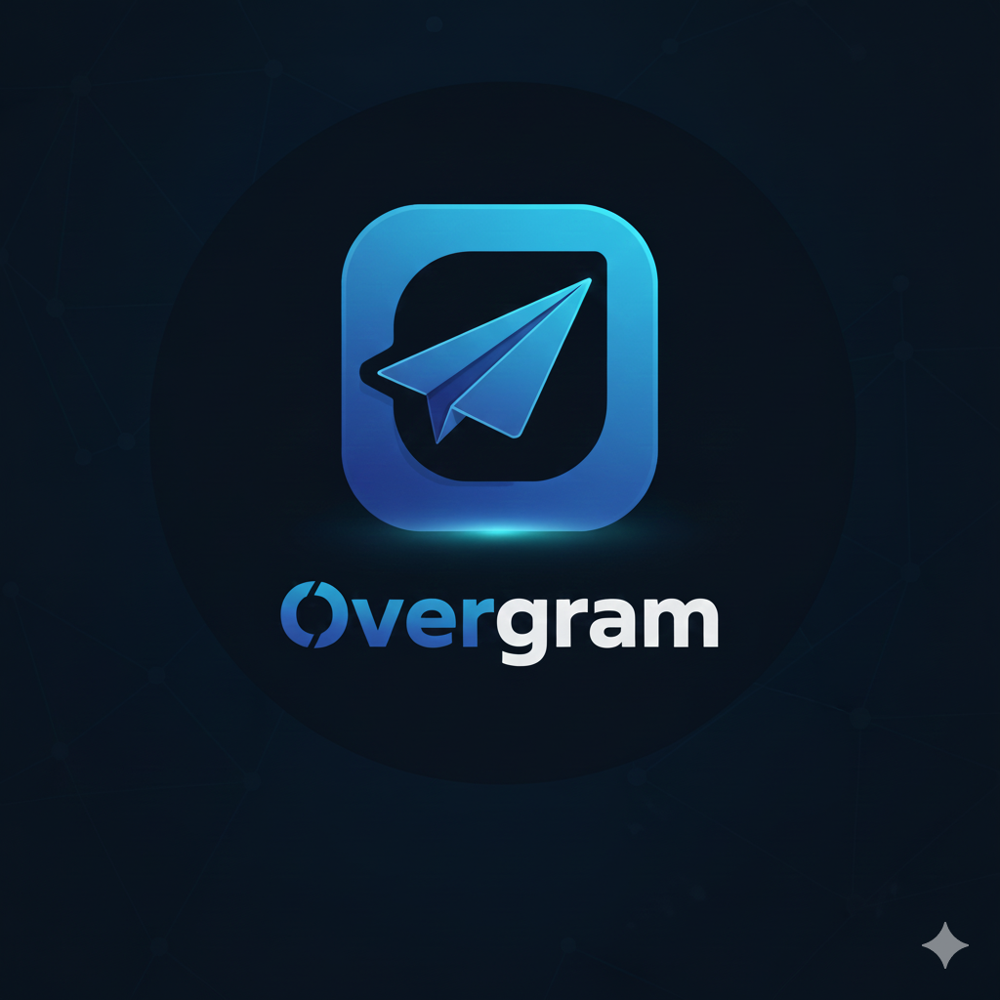

# Overgram for Android

<div align="center">



**Developed by [@overspend1](https://github.com/overspend1)**

[](https://github.com/overspend1/Overgram4A/releases)
[](https://t.me/overgramupdates)
[](LICENSE)
[](https://github.com/overspend1)

</div>

## What is Overgram?

**Overgram for Android** is the most visually stunning Telegram client with the revolutionary **Liquid Glass design system**. It combines beautiful glassmorphism effects with powerful productivity features that make it stand out from every other Telegram fork.

The main difference? Overgram features **real glassmorphism** - actual blur effects on chat bubbles that look absolutely gorgeous. Plus, it **saves** your message history in a local database (not just caching), so you never lose edits or deletions.

Think of it as Telegram meets modern iOS design language, but better. 🎨✨

*And no, it's not an Iranian fork with floating TV or cryptocurrency features.* 😄

## ✨ Features

### 🎨 Liquid Glass Design (FLAGSHIP)
- ✅ **Real Glassmorphism** - True blur effects on chat bubbles
- ✅ **6 Stunning Presets** - Subtle, Standard, Heavy, Frosted, Crystal, Midnight
- ✅ **GPU-Accelerated** - Smooth 60 FPS rendering
- ✅ **Material You Integration** - Dynamic colors on Android 12+
- ✅ **Fully Customizable** - Adjust blur, opacity, saturation, brightness, tint
- ✅ **Battery Optimized** - Smart adaptive quality during animations

### 🔒 Privacy & Security
- ✅ **Local Encryption** - Extra security layer for message database
- ✅ **Biometric Lock** - Fingerprint/Face unlock
- ✅ **Screenshots in Secret Chats** - No restrictions
- ✅ **No Emulator Detection** - Works on all devices
- ✅ **Secure Folder Access** - Protect sensitive chats

### 📝 Message History & Anti-Recall
- ✅ **Message History Database** (flexible) - Saves all message edits and deletions
- ✅ **Anti-Recall** - Keep deleted messages forever
- ✅ **Edit History Tracking** - See all edits made to messages
- ✅ **Save Chats** - Keep chats where you were banned/kicked
- ✅ **Sync with OvergramSync** - Cloud sync of read states and message history

### 🎨 Appearance & Customization
- ✅ **Liquid Glass Design** *(NEW!)* - Modern glassmorphism UI with blur effects
- ✅ **Material You Integration** - Dynamic colors on Android 12+
- ✅ **Custom Themes** - Advanced theming engine from exteraGram
- ✅ **Custom Fonts** - Change app-wide font family
- ✅ **Icon Customization** - Multiple app icon variants
- ✅ **Customizable Marks** - Edit/deleted message indicators

### 🚀 Performance & Features
- ✅ **Local Telegram Premium** - Premium features without subscription
- ✅ **No Ads** - Clean experience
- ✅ **Message Filters** - Filter and hide unwanted content (ads, spam, etc.)
- ✅ **Streamer Mode** - Hide sensitive information
- ✅ **TTL Photos/Videos** - Expire button for self-destructing media
- ✅ **Enhanced Media Viewer** - Better image/video viewing

### 🛠️ Technical Improvements
- ✅ **Built with Official Keys** - Verified Telegram API
- ✅ **Up to Stream Telegram Version** - Latest features and fixes
- ✅ **Optimized Performance** - Faster and smoother
- ✅ **Optional Crashlytics** - Disable crash reporting if you want

**Note**: Overgram4A does **NOT** include proprietary exteraGram features.

## Preview

💖 **Made with extera's Monet theme.**

 

 

 

## 📱 Installation

### Download APK
Follow our **[Telegram channel](https://t.me/overgramupdates)** and join our [chat](https://t.me/overgramchat)!

Get the latest APK from:
- [GitHub Releases](https://github.com/overspend1/Overgram4A/releases)
- [Telegram Channel](https://t.me/overgramupdates)

### From Source
```bash
git clone --recursive https://github.com/overspend1/Overgram4A.git
cd Overgram4A
./gradlew assembleAfatRelease
```

APK will be in `TMessagesProj/build/outputs/apk/afat/release/`

## 🏗️ How to Build

1. Clone source code:
   ```bash
   git clone --recursive https://github.com/overspend1/Overgram4A.git
   ```

2. Open the project in **Android Studio**. It should be **opened**, not imported.

3. Implement the `AyuMessageUtils` & `AyuHistoryHook` classes (or search for reversed version)

4. Replace `google-services.json` with your own (for Firebase/Crashlytics)

5. Generate application certificate and fill `API_KEYS`:
   ```properties
   APP_ID = 6
   APP_HASH = "eb06d4abfb49dc3eeb1aeb98ae0f581e"
   MAPS_V2_API = your_maps_api_key

   SIGNING_KEY_PASSWORD = your_password
   SIGNING_KEY_ALIAS = your_alias
   SIGNING_KEY_STORE_PASSWORD = your_store_password
   ```

6. Build Overgram:
   ```bash
   ./gradlew assembleAfatRelease
   ```

## 🎨 Liquid Glass Feature (NEW!)

Overgram for Android features a beautiful liquid glass design system with:
- **Real-time blur effects** using RenderScript
- **Material 3 glassmorphism** components
- **6 preset styles**: Subtle, Standard, Heavy, Frosted, Crystal, Midnight
- **Customizable parameters**: Blur radius, opacity, saturation, brightness
- **GPU-accelerated** for smooth 60 FPS performance
- **Android 12+ optimizations** using RenderEffect API

See [LIQUID_GLASS_ANDROID.md](LIQUID_GLASS_ANDROID.md) for implementation details.

## 💰 Donations

Developing Overgram is not a simple task. **We'd be grateful for any donation ❤️**

All available methods: **[overgram.one/donate](https://overgram.one/donate)**

## 🔄 OvergramSync

**OvergramSync** is our synchronization service for:
- Read states across devices
- Message history backup
- Settings sync

You can either use our official server or host your own.

Server backend: **[OvergramSync Backend](https://github.com/Overgram/OvergramSyncBackend)**

## 🤝 Contributing

I'd be grateful for any contribution! **Work on any feature you want.**

See [CONTRIBUTING.md](.github/CONTRIBUTING.md) for guidelines.

Areas we need help:
- 🌍 Translations (via Crowdin)
- 🐛 Bug reports and testing
- ✨ Feature development
- 📚 Documentation

## 🌍 Localization

[](https://crowdin.com/project/overgram)
[](https://crowdin.com/project/exteralocales)

We have our own **[Crowdin](https://crowdin.com/project/overgram)**.

But since Overgram is based on exteraGram, also join their project at **[Crowdin](https://crowdin.com/project/exteralocales)**!

## 🍴 Want to Fork?

Well, just fork it. **But please, don't forget to mention us in your README.**

## ⚠️ Disclaimer

This is an unofficial Telegram client. Use at your own risk.
- We are not responsible for any account restrictions
- Some features may violate Telegram ToS
- Keep backups of important data

## 📄 License

GPL-3.0 - See [LICENSE](LICENSE) for details

## 🙏 Credits

Based on:
- **[exteraGram](https://github.com/exteraSquad/exteraGram)** - Feature-rich Telegram fork
- [Telegraher](https://github.com/nikitasius/Telegraher) - Privacy patches
- [Cherrygram](https://github.com/arsLan4k1390/Cherrygram)
- [Nagram](https://github.com/NextAlone/Nagram)
- [Telegram FOSS](https://github.com/Telegram-FOSS-Team/Telegram-FOSS)
- [Telegram for Android](https://github.com/DrKLO/Telegram) - Official app

**Lead Developer**: [@overspend1](https://github.com/overspend1)

Special thanks to:
- @Radolyn for original AyuGram concept
- exteraSquad for the amazing base
- All contributors and supporters

## 🔗 Links

- 🌐 Website: [overgram.one](https://overgram.one)
- 📱 Telegram Channel: [@overgramupdates](https://t.me/overgramupdates)
- 💬 Chat: [@overgramchat](https://t.me/overgramchat)
- 🖥️ Desktop Version: [OvergramDesktop](https://github.com/Overgram/OvergramDesktop)
- 📖 Docs: [docs.overgram.one](https://docs.overgram.one)
- 🔄 Sync Backend: [OvergramSync](https://github.com/Overgram/OvergramSyncBackend)

---

**Overgram for Android** - Make Telegram Your Own 🚀✨
